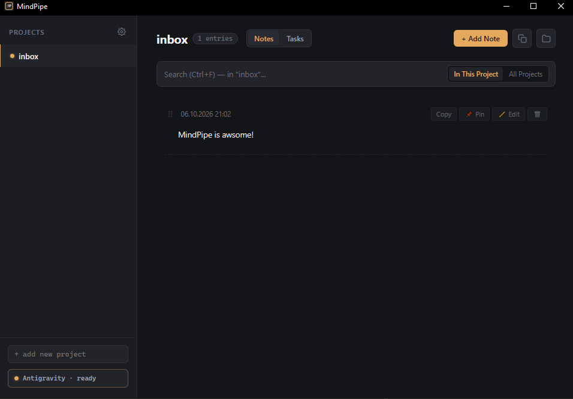
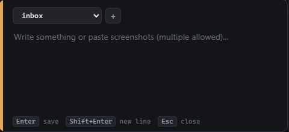
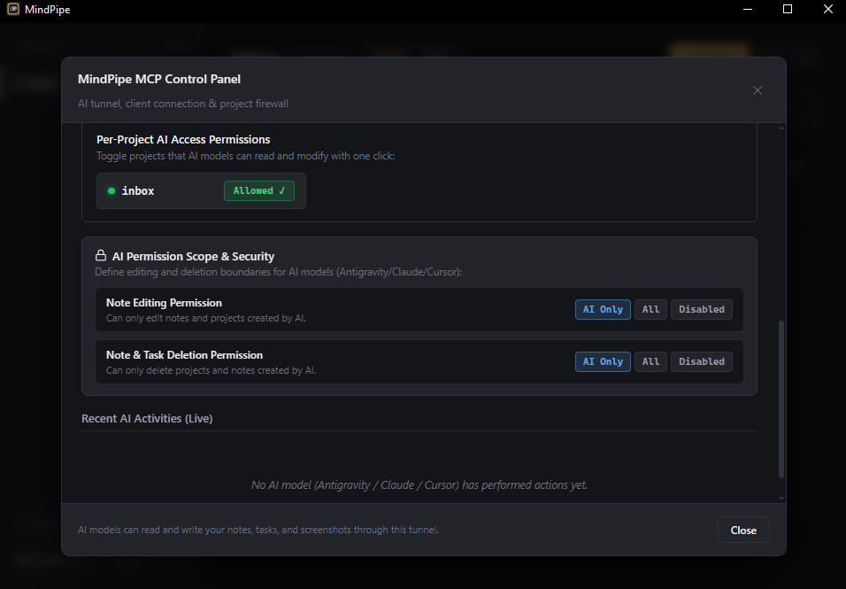
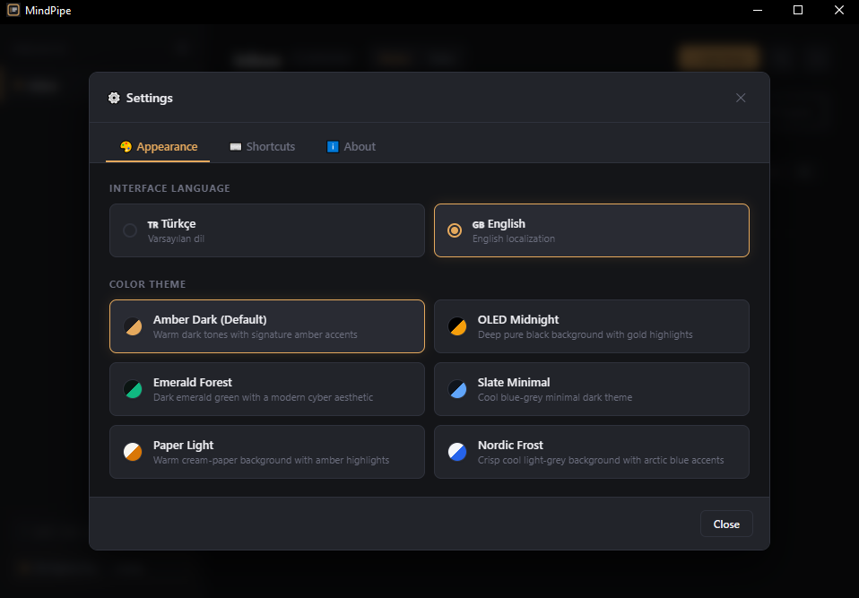
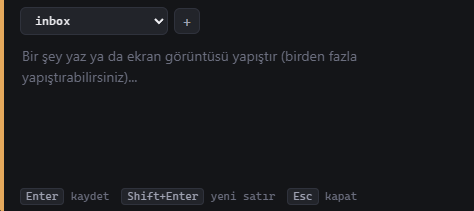
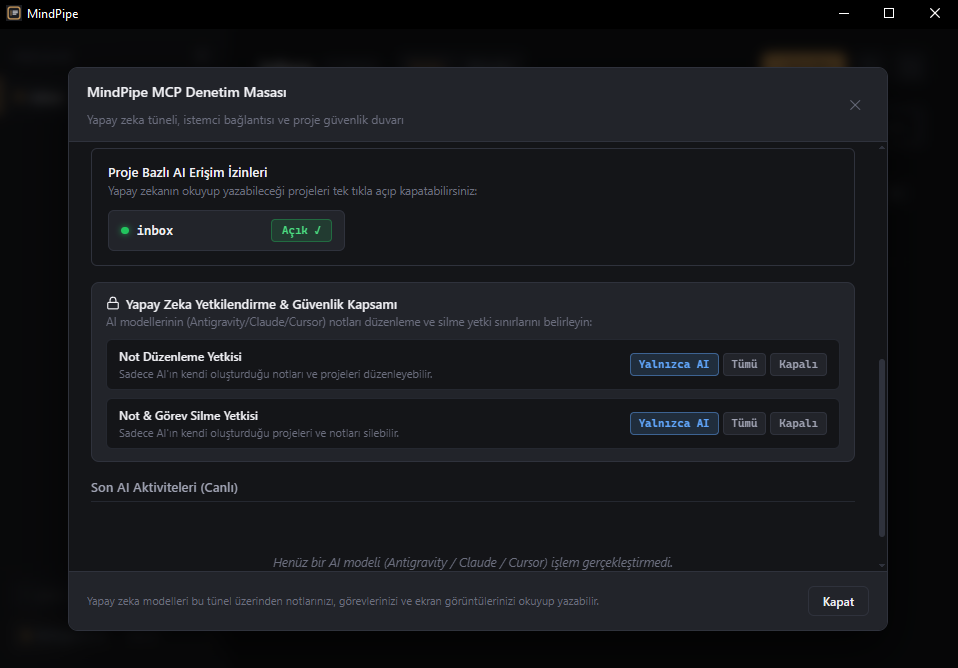
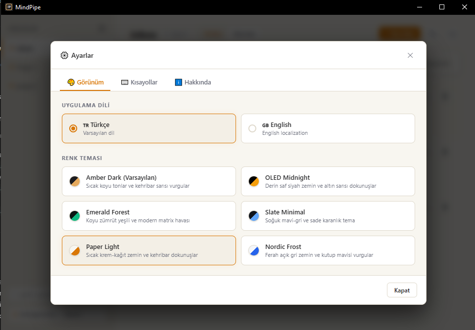
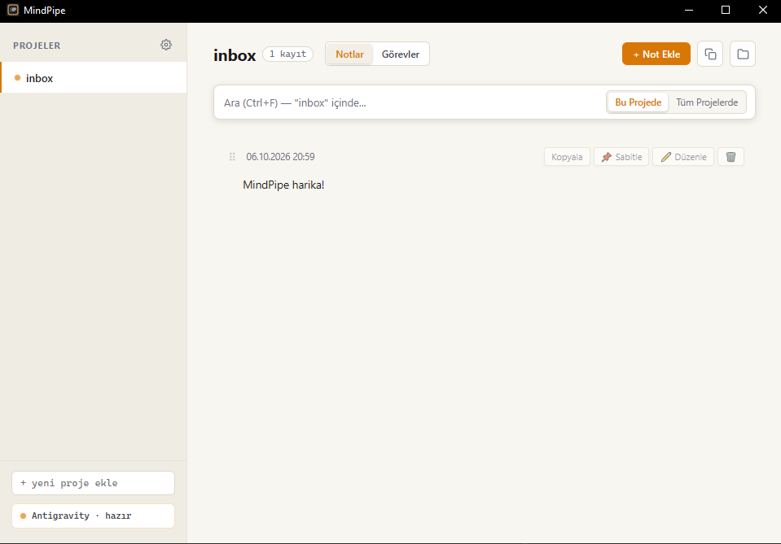

# MindPipe

[English](#english) | [Türkçe](#türkçe)

<p align="center">
  
</p>

---

<a name="english"></a>
## English

MindPipe is a lightweight, local-first desktop application and AI context bridge built with Tauri, Rust, and React. It serves as an instant capture tool, visual project dashboard, and real-time knowledge provider for AI agents via the Model Context Protocol (MCP).

All data is stored directly on your local file system as plain Markdown (`.md`) and standard PNG (`.png`) files. There is no cloud lock-in, no telemetry, and no proprietary database format.

### Download

| Platform | Recommended Package | Type |
| :--- | :--- | :--- |
| **Windows** | [Download `.exe` Setup](https://github.com/YusufB5/MindPipe/releases/latest) | Installer (x64) |
| **macOS** | [Download `.dmg`](https://github.com/YusufB5/MindPipe/releases/latest) | Apple Silicon & Intel |
| **Linux** | [Download `.AppImage`](https://github.com/YusufB5/MindPipe/releases/latest) | Portable (Universal) |

> 💡 All packages and alternative formats (`.msi`, `.deb`) are available on the **[Releases Page](https://github.com/YusufB5/MindPipe/releases/latest)**.

---

### Showcase

| Global Quick Capture (`Ctrl+Shift+N`) | Built-in MCP Control Panel & Firewall |
| :---: | :---: |
|  |  |

| Settings, Customizable Shortcuts & Themes | Continuous DevLog Stream & Tasks |
| :---: | :---: |
|  |  |

---

### Features

- **Global Quick Capture (`Ctrl+Shift+N`):**
  - Summon a minimalist capture bar from anywhere in the OS via a global hotkey.
  - Type quick thoughts or paste multiple screenshots directly from the clipboard (`Win+Shift+S` then `Ctrl+V`).
  - Shortcut is fully customizable (e.g. `Alt+Space`, `Ctrl+Alt+N`) and persists across reboots.
- **Continuous DevLog Stream:**
  - Chronological activity feed with inline Markdown editing (`Ctrl+S`).
  - Pin important reference notes permanently to the top.
  - Collapsible cards for long logs (`Read more` / `Show less`).
  - Drag-and-drop manual card reordering, saved per project (`.order.json`).
  - Full-size image lightbox with multi-screenshot gallery reels.
  - Direct image pasting into the "+ Add Note" form on the dashboard.
- **Project Organization & Tasks (TODOs):**
  - Clean workspaces for your codebases, ideas, and devlogs.
  - Project task management stored in human-readable plain text (`todos.md`).
  - Separate pending and completed lists with live task counter badges.
  - One-click native folder access in File Explorer.
- **Embedded Model Context Protocol (MCP) Server:**
  - Independent JSON-RPC 2.0 stdio server (`mcp-server.cjs`).
  - The binary automatically extracts `mcp-server.cjs` to your user AppData directory on launch.
  - Connects seamlessly to Claude Desktop, Cursor, Antigravity, Codex, and Windsurf.
  - Non-intrusive background file watcher providing real-time live synchronization between external AI modifications and the desktop UI.
  - Visual AI sparkle badge identifying projects, notes, and tasks created or managed by AI models.
- **Granular Security Firewall & Permissions:**
  - Per-project access control: toggle AI read/write access per project with one click.
  - Permission scoping: configure AI edit and delete rights (`only_ai` created items, `all` items, or `none`).
  - Live activity pulse and audit log feed.
- **6 Color Themes & Custom Scrollbars:**
  - Dark Themes: Amber Dark (Default), OLED Midnight, Emerald Forest, Slate Minimal.
  - Light Themes: Paper Light (Warm Cream & Amber), Nordic Frost (Cool Grey & Sky Blue).
  - Modern sleek custom scrollbars matching the active theme palette.
- **Bilingual Localization:**
  - Switch between English and Turkish in real-time from the Settings menu.

---

### Architecture

- **Backend:** Rust (Tauri v2), handling global shortcuts, native file I/O, system tray lifecycle, and cross-platform window management.
- **Frontend:** React 18, TypeScript, Vite, with zero external UI framework dependencies.
- **MCP Server:** Embedded Node.js script communicating via standard input/output (`stdio`).
- **Storage Location:**
  - Windows: `%APPDATA%\com.mindpipe.app\projects\<project>\`
  - macOS: `~/Library/Application Support/com.mindpipe.app/projects/<project>/`
  - Linux: `~/.config/com.mindpipe.app/projects/<project>/`

---

### MCP Configuration

You can copy your pre-filled, personal configuration snippet directly by opening MindPipe and clicking the MCP Status bar on the bottom-left.

**Standard JSON (Claude Desktop, Cursor, Antigravity, Windsurf):**
- Claude Desktop: `%APPDATA%\Claude\claude_desktop_config.json`
- Cursor: `~/.cursor/mcp.json`
- Antigravity: `~/.gemini/config/mcp_config.json`

```json
{
  "mcpServers": {
    "mindpipe": {
      "command": "node",
      "args": [
        "C:\\Users\\<YOUR_USERNAME>\\AppData\\Roaming\\com.mindpipe.app\\mcp-server.cjs"
      ]
    }
  }
}
```

**Codex CLI (TOML):**
- Path: `~/.codex/config.toml`

```toml
[mcp_servers.mindpipe]
command = "node"
args = ['C:\Users\<YOUR_USERNAME>\AppData\Roaming\com.mindpipe.app\mcp-server.cjs']
```

---

### Development & Build

#### Prerequisites
- Node.js 18+
- Rust (stable toolchain via `rustup`)
- [Tauri Prerequisites](https://v2.tauri.app/start/prerequisites/)

#### Development
```bash
# Install dependencies
npm install

# Run in development mode
npm run tauri dev
```

#### Production Build
```bash
# Compile optimized desktop binary and installers (EXE / MSI)
npm run tauri build
```
Compiled outputs will be located in `src-tauri/target/release/bundle/nsis/` and `src-tauri/target/release/bundle/msi/`.

---

<a name="türkçe"></a>
## Türkçe

MindPipe, Tauri, Rust ve React ile geliştirilmiş, hafif ve yerel öncelikli (local-first) masaüstü programı ve yapay zeka bağlam köprüsüdür. Hem hızlı bir not ve ekran görüntüsü yakalama aracı, hem kronolojik bir DevLog akışı, hem entegre bir görev yöneticisi, hem de Model Context Protocol (MCP) üzerinden yapay zeka ajanlarına doğrudan yapılandırılmış proje bilgisi aktaran bir terminaldir.

Tüm veriler doğrudan yerel dosya sisteminizde düz Markdown (`.md`) ve standart görsel (`.png`) dosyaları olarak tutulur. Bulut zorunluluğu, telemetri takibi ve kapalı veritabanı formatları bulunmaz.

### İndir

| Platform | Önerilen Paket | Tür |
| :--- | :--- | :--- |
| **Windows** | [`.exe` Kurulum Dosyasını İndir](https://github.com/YusufB5/MindPipe/releases/latest) | Kurulum Sihirbazı (x64) |
| **macOS** | [`.dmg` İndir](https://github.com/YusufB5/MindPipe/releases/latest) | Apple Silicon & Intel |
| **Linux** | [`.AppImage` İndir](https://github.com/YusufB5/MindPipe/releases/latest) | Taşınabilir (Universal) |

> 💡 Tüm bağımsız kurulum paketleri ve alternatif formatlar (`.msi`, `.deb`) **[Releases Sayfasında](https://github.com/YusufB5/MindPipe/releases/latest)** yer almaktadır.

---

### Ekran Görüntüleri

| Global Hızlı Yakalama (`Ctrl+Shift+N`) | Entegre MCP Denetim Masası & Güvenlik Duvarı |
| :---: | :---: |
|  |  |

| Ayarlar, Özelleştirilebilir Kısayollar & Temalar | DevLog Akışı & Görev Panosu |
| :---: | :---: |
|  |  |

---

### Özellikler

- **Global Hızlı Yakalama (`Ctrl+Shift+N`):**
  - İşletim sisteminin herhangi bir yerindeyken tek tuşla minimalist yakalama penceresini açın.
  - Hızlı notlar yazın veya panodaki ekran alıntılarını doğrudan yapıştırın (`Win+Shift+S` ardından `Ctrl+V`).
  - Global kısayol Ayarlar menüsünden tamamen özelleştirilebilir (`Alt+Space`, `Ctrl+Alt+N` vb.).
- **DevLog Sürekli Akışı:**
  - Kronolojik not akışı ve satır içi anlık Markdown düzenleme (`Ctrl+S`).
  - Önemli notları ve yönergeleri en üstte sabitleme (pin) desteği.
  - Uzun notlar için daraltma (`Devamını Gör` / `Daha az göster`).
  - Sürükle-bırak ile serbest kart sıralama (proje bazında `.order.json` dosyasında saklanır).
  - Çoklu ekran alıntıları için tam ekran görsel lightbox büyütücüsü.
  - Ana pano üzerindeki "+ Not Ekle" alanında doğrudan panodan görsel yapıştırma (`Ctrl+V`).
- **Proje Organizasyonu ve Görevler (TODOs):**
  - Projelerinizi ayrı çalışma alanlarında izole edin.
  - Düz metin dosyasında tutulan görev listesi (`todos.md`).
  - Bekleyen ve tamamlanan görevler için ayrılmış sekmeler ve sayaçlar.
  - Tek tıkla yerel klasörü Dosya Gezgini'nde açma.
- **Gömülü Model Context Protocol (MCP) Sunucusu:**
  - Bağımsız JSON-RPC 2.0 stdio sunucusu (`mcp-server.cjs`).
  - Program ilk açılışta `mcp-server.cjs` dosyasını kullanıcının AppData klasörüne otomatik çıkartır.
  - Claude Desktop, Cursor, Antigravity, Codex ve Windsurf ile anında tam uyum.
  - Arka planda çalışan hafif dosya izleyici ile yapay zekanın yaptığı değişiklikler masaüstü panosuna canlı yansır.
  - AI ajanlarının ürettiği notlarda ve görevlerde görsel AI mikroçip rozeti ile şeffaf kaynak takibi.
- **Güvenlik Duvarı ve İzin Yönetimi:**
  - Proje bazlı erişim denetimi: AI modellerinin hangi projelere erişebileceğini tek tıkla açıp kapatın.
  - Yetki kapsamı: not düzenleme ve silme sınırlarını belirleyin (sadece AI'ın kendi ürettikleri, tümü veya salt okunur).
  - Canlı işlem nabzı ve işlem geçmişi denetim günlüğü.
- **6 Renk Teması & Dinamik Kaydırma Çubukları:**
  - Karanlık Temalar: Amber Dark (Varsayılan), OLED Midnight, Emerald Forest, Slate Minimal.
  - Açık Temalar: Paper Light (Sıcak Kağıt & Amber), Nordic Frost (Ferah Gri & Kutup Mavisi).
  - Seçilen temaya göre otomatik renk alan modern ve ince kaydırma çubukları.
- **Çift Dil Desteği:**
  - Ayarlar menüsünden Türkçe ve İngilizce dilleri arasında anında geçiş yapın.

---

### MCP Yapılandırması

MindPipe'ı açıp sol alttaki MCP Durum çubuğuna tıkladığınızda sisteminize özel hazır JSON kodunu tek tıkla kopyalayabilirsiniz.

**Standart JSON (Claude Desktop, Cursor, Antigravity, Windsurf):**
- Claude Desktop: `%APPDATA%\Claude\claude_desktop_config.json`
- Cursor: `~/.cursor/mcp.json`
- Antigravity: `~/.gemini/config/mcp_config.json`

```json
{
  "mcpServers": {
    "mindpipe": {
      "command": "node",
      "args": [
        "C:\\Users\\<KULLANICI_ADINIZ>\\AppData\\Roaming\\com.mindpipe.app\\mcp-server.cjs"
      ]
    }
  }
}
```

**Codex CLI (TOML):**
- Dosya: `~/.codex/config.toml`

```toml
[mcp_servers.mindpipe]
command = "node"
args = ['C:\Users\<KULLANICI_ADINIZ>\AppData\Roaming\com.mindpipe.app\mcp-server.cjs']
```

---

### Geliştirme ve Derleme

#### Gereksinimler
- Node.js 18+
- Rust (rustup ile güncel stable sürüm)
- [Tauri Başlangıç Kılavuzu](https://v2.tauri.app/start/prerequisites/)

#### Geliştirme Ortamı
```bash
# Bağımlılıkları yükleyin
npm install

# Geliştirme modunda çalıştırın
npm run tauri dev
```

#### Üretim Derlemesi (Build)
```bash
# Optimize edilmiş EXE ve kurulum paketlerini derleyin
npm run tauri build
```
Derleme çıktıları `src-tauri/target/release/bundle/nsis/` ve `src-tauri/target/release/bundle/msi/` klasörlerinde üretilir.

---

### Lisans
MIT License.
